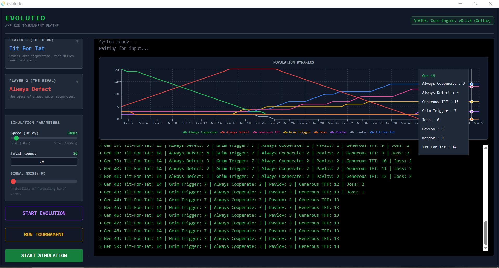
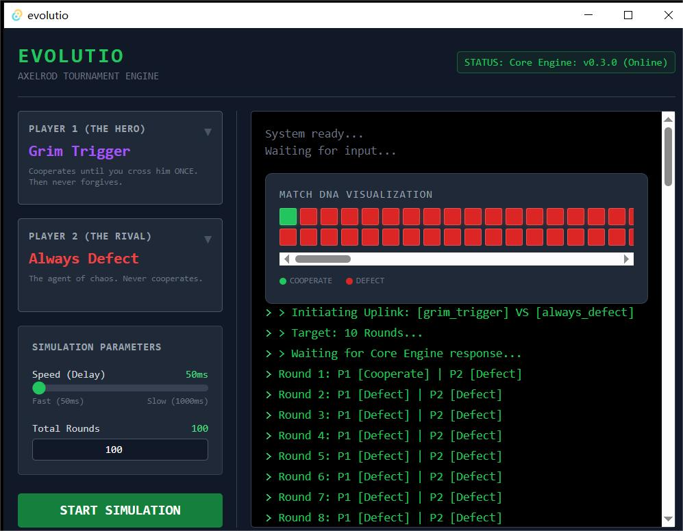

# Evolutio: Axelrod Tournament Engine

Evolutio is a high-performance, desktop-based Game Theory engine that simulates the Iterated Prisoner's Dilemma. Built with Rust, Tauri, and React, it explores how cooperation evolves, survives, or perishes in an ecosystem driven by self-interest, miscommunication, and natural selection.

## Core Features

* **1v1 Simulation Engine:** Execute round-by-round strategy matchups with customizable speeds, allowing for micro-level analysis of interactions and retaliation loops.
* **Round-Robin Tournament:** Pit multiple strategies against each other to evaluate overall fitness and cumulative scoring within a static ecosystem.
* **Signal Noise (Trembling Hand Error):** Inject probabilistic errors (0% - 50%) into the decision-making process. This models real-world miscommunication, demonstrating how strict retaliatory strategies (like Tit-For-Tat) can collapse into death spirals, and validating forgiveness as a mathematical necessity.
* **Evolutionary Dynamics:** Simulate generations of natural selection using replicator dynamics. The fittest strategies reproduce (population increases), while the weakest face extinction, allowing for macro-level observation of ecological shifts.
* **Real-Time Data Visualization:** Powered by Recharts, the engine renders dynamic line charts tracking population booms, predator-prey cycles, and the stabilization of cooperative regimes across generations.

## Screenshots

**Evolutionary Dynamics & Data Visualization**

*Observing the extinction of pure defectors and the rise of cooperative strategies across generations.*

**1v1 Simulation & UI Dashboard**

*Detailed round-by-round analysis with customizable signal noise and execution speed.*

## Strategy Gene Pool

The engine currently implements 8 distinct autonomous agents, each representing a foundational game theory strategy:

1. **Always Cooperate:** Unconditionally cooperates. Serves as a baseline and primary target for exploitation.
2. **Always Defect:** Unconditionally defects. Thrives on exploitation but suffers in homogenous populations.
3. **Tit-For-Tat:** Cooperates on the first move, then strictly mimics the opponent's previous move.
4. **Grim Trigger:** Cooperates initially but retaliates with permanent defection after a single betrayal.
5. **Pavlov (Win-Stay, Lose-Shift):** Maintains its current behavior if the previous payoff was high (>=3), but switches if the payoff was low.
6. **Random:** Executes cooperation or defection with a 50/50 probability.
7. **Generous Tit-For-Tat:** Similar to Tit-For-Tat, but incorporates a 10% probability of forgiving a defection to prevent infinite retaliation loops in noisy environments.
8. **Joss:** A deceptive variant of Tit-For-Tat that attempts to exploit opponents by randomly defecting 10% of the time.

## Tech Stack

* **Core Engine:** Rust (Ensures high performance and memory safety for heavy simulation loops)
* **Desktop Binding:** Tauri
* **Frontend UI:** React + TypeScript + Vite
* **Styling & Visualization:** Tailwind CSS, Recharts

## Getting Started

### Prerequisites
Ensure you have the following installed:
* [Node.js](https://nodejs.org/)
* [Rust](https://www.rust-lang.org/tools/install)
* OS-specific dependencies required by Tauri (e.g., MSVC on Windows, WebKit on macOS/Linux).

### Recommended IDE Setup
- [VS Code](https://code.visualstudio.com/) 
- [Tauri Extension](https://marketplace.visualstudio.com/items?itemName=tauri-apps.tauri-vscode) 
- [rust-analyzer](https://marketplace.visualstudio.com/items?itemName=rust-lang.rust-analyzer)

### Installation & Execution

1. Clone the repository and install frontend dependencies:
   ```bash
   npm install

2. Start the Vite development server and the Rust backend:
   ```bash
   npm run tauri dev

3. Build the executable for production:
   ```bash
   npm run tauri build
   
Developed as an interactive exploration of Robert Axelrod's "The Evolution of Cooperation".